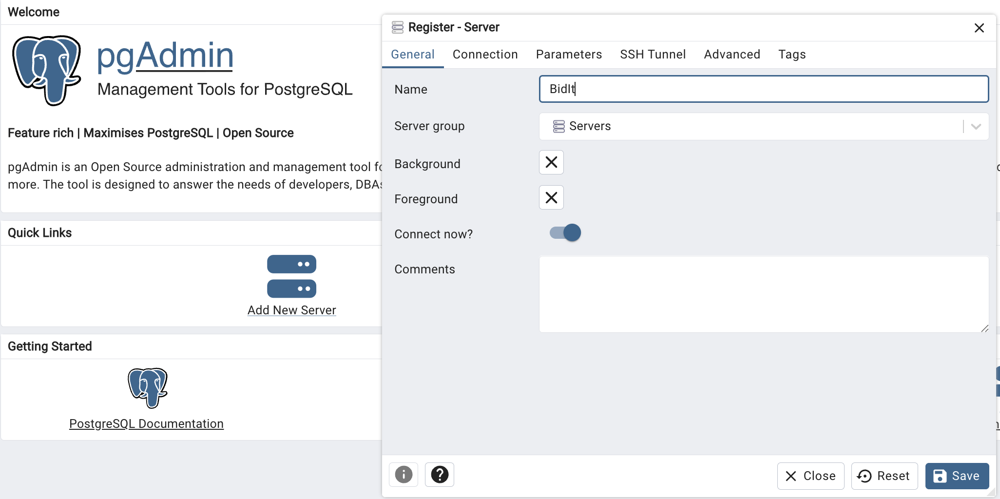
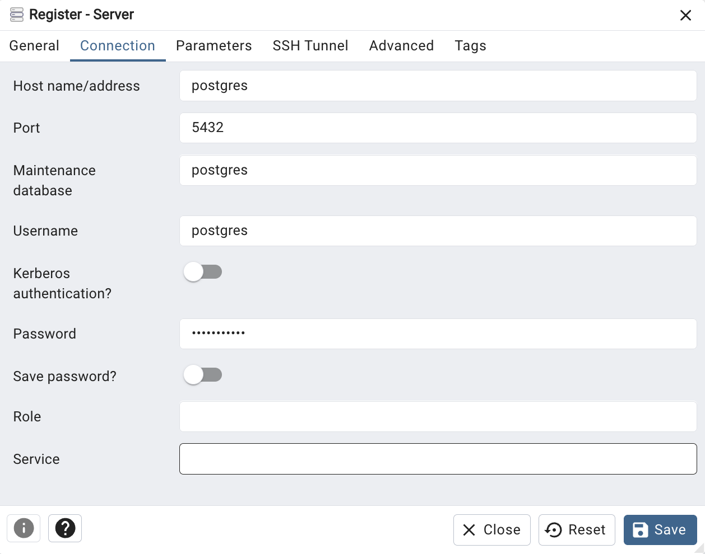

# BidIt – Online Auctions Platform

An online auctions web application built with **Laravel** and **PostgreSQL**, developed as part of the **LBAW 2024/2025** course.

---

## Features
- User authentication (including Google login via Socialite)  
- Auction creation and bidding  
- Email notifications via **Mailtrap**  
- Location-based services via **LocationIQ**  
- Admin tools for managing users and auctions  

---

## Requirements
Make sure you have installed:
- [Docker](https://www.docker.com/) & [Docker Compose](https://docs.docker.com/compose/)  
- [PHP 8.2+](https://www.php.net/)  
- [Composer](https://getcomposer.org/)  
- [Node.js & npm](https://nodejs.org/)  
- [psql](https://www.postgresql.org/docs/current/app-psql.html) (Postgres client CLI)  

---

## 🛠️ Setup Instructions

### 1. Start PostgreSQL and pgAdmin
From the project root, start the services:

```bash
docker compose up -d
```


### 2. Environment configuration
- Update .env with at least the database and application variables:
```bash
APP_NAME=BidIt
APP_ENV=local
APP_KEY=base64:<your-app-key>
APP_DEBUG=true
APP_URL=http://localhost:8000

DB_CONNECTION=pgsql
DB_HOST=localhost
DB_PORT=5432
DB_SCHEMA=lbaw2476
DB_DATABASE=postgres
DB_USERNAME=postgres
DB_PASSWORD=pg!password
```
- Generate the application key:
```bash
php artisan key:generate	# Replaces <your-app-key> with the generated key
```

### 3. Start Docker containers
- Run PostgreSQL and pgAdmin:
```bash
docker compose up -d
# Open http://localhost:4321/browser/
```
- Configure pgAdmin to connect to PostgreSQL:
    - Server Name: localhost
	- Username: postgres
	- Password: pg!password
	- Database: postgres
	- Port: 5432




### 4. Initialize the database
- Access PostgreSQL using psql (use the command from the root, otherwise you need to change the path to the DB):
```bash
psql -U postgres -h localhost
# The password that is asked is the one from the .env file (DB_PASSWORD=pg!password)
\i /Users/joselopes/Desktop/lbaw24076/database/proj.sql
```

### 5. Install PHP dependencies
```bash
composer install
# Optional
npm install
npm run dev
```

### 6. Serve the application
```bash
php artisan serve
# Open the browser at http://localhost:8000
```

## Usage

### Administration Credentials 

| Username                       | Password  |
|--------------------------------|-----------|
| professoradmin@example.com      | 12345678  |

### User Credentials

| Type       | Username                     | Password  |
|------------|------------------------------|-----------|
| User       | professor@example.com        | 12345678  |
| Premium    | professor@example.com        | 12345678  |

> Use these predefined accounts to test the application features, including auctions, bidding, and admin management.

## Team

| Name | Email |
|------|-------|
| Mário José Ribeiro Araújo | up202208374@up.pt |
| Ângelo Rafael Araújo Oliveira | up202207798@up.pt |
| José Filipe Silva Lopes | up202208288@up.pt |
| José Pedro Pereira da Costa | up202207871@up.pt |